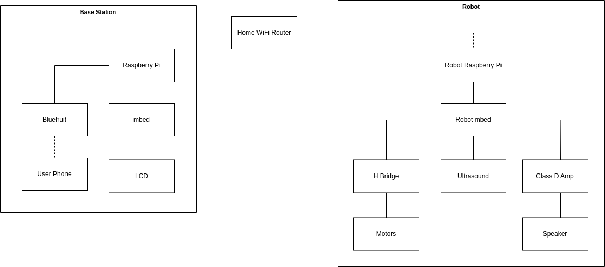

# Project Summary

When you have the sleep cycle of a typical Georgia Tech student, waking up can be difficult. While traditional alarm clocks are loud, they have a fatal flaw: they don't run away from you. Our project comes in two parts: a traditional alarm that sits next to your bed and displays the time, and a small robot that contains a speaker and a button. When the alarm sounds, the robot drives and plays a loud siren, while the LCD on the base station displays a code. To disable the alarm, you must both catch the robot and press it's button, and use your phone (connected via bluetooth) to enter the displayed code.

# Design Overview

