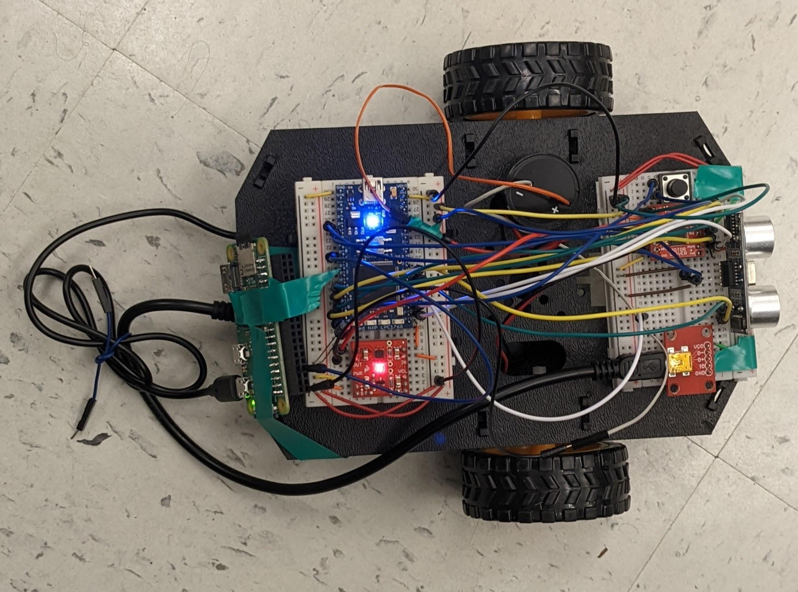
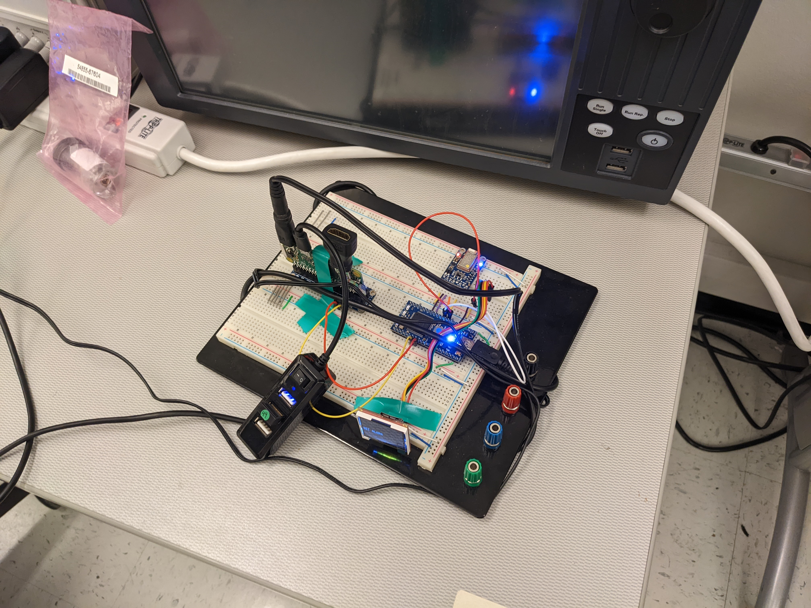

# Project Summary

When you have the sleep cycle of a typical Georgia Tech student, waking up can be difficult. While traditional alarm clocks are loud, they have a fatal flaw: they don't run away from you. Our project comes in two parts: a traditional alarm that sits next to your bed and displays the time, and a small robot that contains a speaker and a button. When the alarm sounds, the robot drives and plays a loud siren, while the LCD on the base station displays a code. To disable the alarm, you must both catch the robot and press it's button, and use your phone (connected via bluetooth) to enter the displayed code.

# Overall Design

# Hardware Overview

## Robot Hardware

### Parts List

- mbed LPC1768
- Raspberry Pi Zero W
- HC-SR04 sonar
- Dual H-Bridge
- Class D audio amp
- Shadow robot kit
- DC motor
- Speaker
- USB power bank

## Base Station Hardware

### Parts List

- Raspberry Pi Zero W
- mbed LPC1768
- uLCD-144-G2
- Bluefruit BLE

# Software Overview

The software for this project can be found in the following repositories:

- [Robot mbed](https://github.com/thomasmholder/TheRoboAwakening)
- [Raspberry Pi Zero Ws (both)](https://github.gatech.edu/ddohner3/ECE4180-Design-Project-Pi)
- [Base Station mbed](https://github.com/thomasmholder/TheRoboAwakeningLCD)

# Demo Video

<iframe width="560" height="315" src="https://www.youtube.com/embed/QGZww1Yys34" title="YouTube video player" frameborder="0" allow="accelerometer; autoplay; clipboard-write; encrypted-media; gyroscope; picture-in-picture; web-share" allowfullscreen></iframe>
